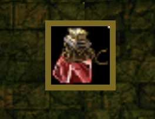
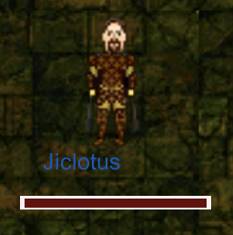
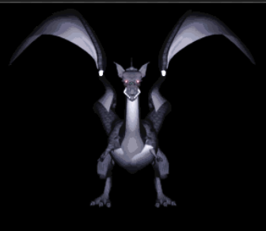
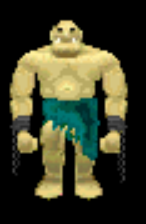

# Inmortalao Unity 2d

This project was intended to do a POC that has been made in just one day!

Main purpose was to test Unity 2d animations and use the Argentum Online resources. That said, code and animation relations are not the best way to do it at all, so please do not use it in a professional way, and use it just for fun! Besides, project itself
does not support tiles or just bidirectional moves(up/down + left/right), you can go diagonal as well

Furthermore folders were created by using Unity patterns

# Unity version

Project was created using `Unity 2020.1.3f1`

# How to install

1. Download [Unity Hub](https://unity.com/unity-hub)
2. Download `Unity 2020.1.3f1` from Unity Hub
3. Load the main `inmortalao-unity` folder from the Unity Hub

# Functionalities

- Main character sprites
- Main character headings -> Walk + Header
- Basic health potion
- Display basic character info
- Basic dungeon load
- Two basic creatures
- Basic particle system from Unity plugin

The game will end once you kill the Dragon

# Overview

This game is about an RPG game where you need to kill monsters in order to gain experience and in consequence, increasing your level to be able and prepared to beat the final boss. 

There is 4 states:

Start -> Where you need to enter your player name and login to the game to start. Will conduct to the Play State
Play -> Play state will able to move your player character to kill monsters
Won -> When killing the boss character you will conduct to this scene. Then you will be able to go to Start state again doing space bar
End -> When you lose your health you will conduct to this scene. Then you will be able to go to Start state again doing space bar

We have two prefabs Ogre and Dragon. Those are used to  autogenerate NPC

Every NPC (Dragon or Ogres) have a programmed AI that allows him to follow and attack the character if he is near to him

# How to win the game?

To win you must kill the final boss which is a Dragon. The Dragon is a powerful creature where is not so easy to beat, so in order to be capable to kill the dragon you need to ensure to have enough level. 

Dragon creature will spawn when you kill more than 30 spawned Ogres. 

The game will ALWAYS maintain 15 ogres spawned at the same time. So will ensure that you will have NPC to beat every time. 

When killing ogres you will increase your experience by the strength of the NPC. When receiving a hit by an NPC you will receive that hit based on the strength attribute of the NCP.

Player will start with level 1, health 40, and strength 10

Every time that you pass the total current level experience you will go to the next level. On every level up your next total level experience will increase by new level value * 20,  and for sure your strength will increase by the current strength * 2 as well.

# Avoiding to lose

To lose you need to recover your Health when you receive any hit from any NPC. To gain health just consume the potion icon inventory doing click action
You will increase the health parameter by 10 units.

# When Dragos are being spawned?

Dragons will spawn when the character killed more than 100 Ogres creatures

# Walls

You cannot go through the walls. The dungeon will be always the same 30 squares by 30 squares where every square is 32x32 pixel dimension.

# Characters

| Name |  Image | Description | Health | Strength |
| --- | --- | --- | --- | --- |
| `Player` |  | Player is the brabest human in this universe. He is in charge to deal with the whole monsters to clean this evil world | 40 level 1 | 10 level 1 |
| `Dragon` |  | The dragon is a mythical creature where possesses all treasures. Ogres are they protectors  | 1000 | 10 |
| `Ogre` |  | Ogres live in dungeons since 1000 years ago. They have the characteristic to reproduce pretty fast. | 200 | 10 |

# Images

# Video

